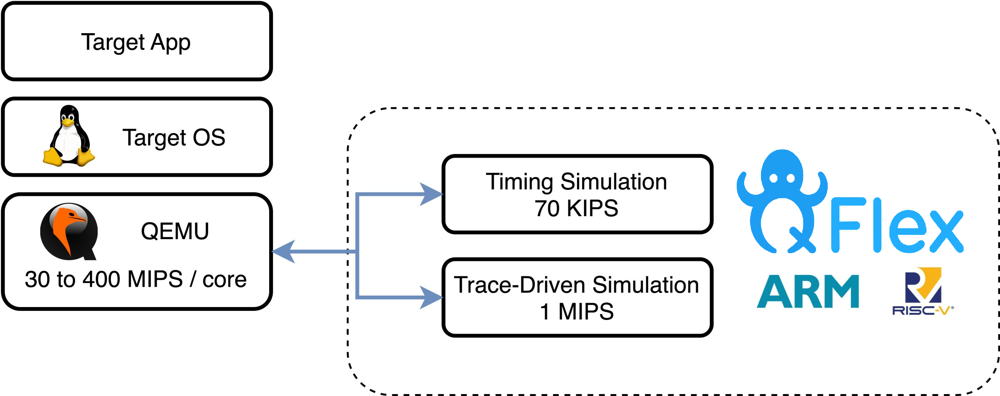

# QFlex | Quick & Flexible Computer Architecture Simulation

State-of-the-art modeling tools for the computer architecture community.  
The QFlex project targets quick, accurate, and flexible simulation of computer systems.

---

## Download QFlex

- QFlex’s source code is hosted on **GitHub**: [parsa-epfl/qflex](https://github.com/parsa-epfl/qflex)  
- QFlex is available both as a **command-line tool (CLI)** and as a **Docker image**, making setup and integration straightforward.  
- For a quick start, visit the [quickstart section](quickstart).

---

## About QFlex

Computer systems hardware and software designers have traditionally relied on fast emulation and full-system simulation to instrument a design of interest, develop and debug system software, model new hardware components and measure design metrics of interest. Post-Moore platforms in recent years have not only seen a proliferation of accelerators but also the need for system hardware/software co-design to help integrate heterogeneity into the system stack. Effective integration requires open-source tools that enable fast instrumentation of application and system software, full-system models for network and storage controllers, and models of multi-node computer systems. Full-system server instrumentation and modeling requires several orders of magnitude in speed to enable practical turnaround. QFlex is a family of full-system instrumentation tools based on QEMU which currently supports the ARM and RISC-V ISA. QFlex includes a trace-based model to quickly instrument existing QEMU images, and timing models to simulate multi-core CPUs in detail. It includes:

- A **trace-based model** for quickly instrumenting existing QEMU images  
- **Timing models** to simulate multicore CPU microarchitecture  
- With support for multi-node simulation coming soon.

For more details, modules, and citations, see the project documentation and the GitHub repo.

---

## News / Releases

### QFlex v2.0 Released

Released March 20, 2020. QFlex continues to support trace-based simulation and timing models. (See release notes on GitHub.)  

### QFlex v1.0 Released

Released April 1, 2017. QFlex enabled full-system microarchitectural simulation of multicores running unmodified applications. A CloudSuite workload image was provided. ([zenodo.org](https://zenodo.org/records/504368))  

We encourage users to **watch the GitHub repository** and file issues for enhancements or bug fixes.

---

## Related Projects & Links

- **Flexus** (cycle-accurate simulator used in QFlex): [parsa-epfl/flexus](https://github.com/parsa-epfl/flexus)  
- **libqflex** (API between QEMU and Flexus): [parsa-epfl/libqflex](https://github.com/parsa-epfl/libqflex)  
- EPFL’s EcoCloud page on QFlex: [EcoCloud – QFlex](https://ecocloud.epfl.ch/research/sustainable-it-infrastructure/qflex/)  

---

## Citation / Licensing & Acknowledgments

- QFlex is open source under licenses as described in the GitHub repository.  
- The project relies on QEMU, Boost, Conan, and other components, each governed by their own licenses.  

© 2025 EPFL PARSA – 1015 Lausanne, Switzerland – tel. +41 21 693 1395 – All Rights Reserved
